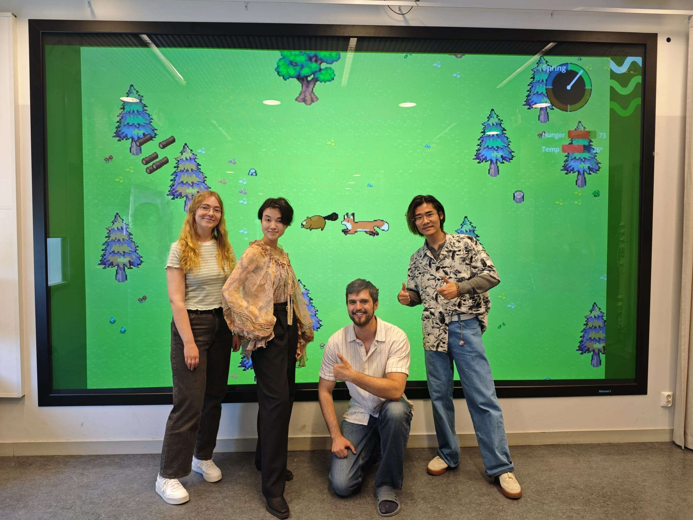

+++
title = "Team"
render = true
template = "team.html"

[[extra.members]]
name = "Natalie"
role = "Programmer"
linkedin = "https://www.linkedin.com/in/natalie-eriksson-b40688268"
website = ""

[[extra.members]]
name = "Maryam"
role = "Artist"
linkedin = "https://www.linkedin.com/in/maryam-khan-b68b2221b"
website = ""

[[extra.members]]
name = "Alex"
role = "Programmer"
linkedin = ""
website = "https://alexander.rs"

[[extra.members]]
name = "Pan"
role = "Programmer"
linkedin = "https://www.linkedin.com/in/guoxi-pan-b758bb35b"
website = "https://felixpppan.github.io/MyPersonalWeb/#/"

[[extra.members]]
name = "Berry Lu"
role = "UX/UI"
linkedin = ""
website = ""
+++

*(From left to right: Natalie, Maryam, Alex, Pan)*

Designer: all of us!~
